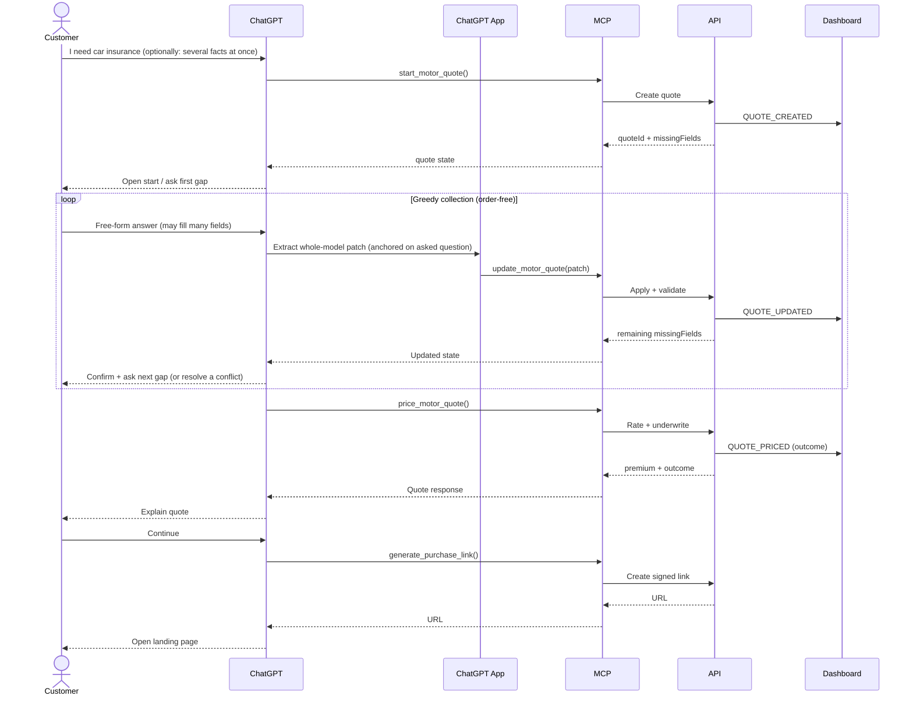

# ACME Motor Quote ChatGPT App — Proof of Concept Build Brief (v1.0)

> **Audience:** the engineering team building the real PoC — the ChatGPT App, the
> MCP server, the mock insurer APIs, the mock quote/purchase landing page, and the
> mock submissions dashboard.
>
> **Naming:** "ACME" is a placeholder for the client. There must be **no real
> brand, product, or trademark references anywhere** in code, data, mocks, prompts,
> or UI. Where the data model reflects a real insurer's capture screens, it is
> described generically as "a representative UK motor insurer's capture form."

---

## 1. Executive Summary

### Purpose

Demonstrate how a UK private motor insurance quotation journey can be delivered
through a **ChatGPT App** backed by an **MCP server**, with the insurer's APIs as
the source of truth. The architecture deliberately mirrors a realistic insurer
implementation while using only mock services and synthetic data.

### What this PoC proves

- ChatGPT as the **conversation layer** — natural language understanding, asking,
  explaining, clarifying — owning none of the business logic.
- MCP as the **integration layer** — typed tools, contract enforcement,
  translation between ChatGPT and the insurer APIs.
- Insurer APIs as the **source of truth** — state, validation, pricing,
  underwriting outcomes.
- **Document-assisted** quote creation (upload a policy/renewal/licence; extract
  what can be completed).
- **Order-free, greedy** data collection driven by the whole data model.
- **Quote continuation**, **referral/decline** outcomes, **alternative-channel
  routing**, and **handoff into a purchase journey**.
- **Live observability** through a dashboard fed by an append-only event store.

### Goals

1. A stakeholder can install the ACME ChatGPT App and obtain a quote end-to-end.
2. They can upload a document and watch fields auto-populate.
3. They can watch the dashboard update live as the conversation progresses.
4. They can resume a saved quote, and trigger referral/decline/routing paths.
5. They can follow a purchase link to a mock landing page that renders the quote.

### Non-goals for the PoC

Real rating accuracy, production hosting, real identity/auth, PCI-scoped payments,
and policy issuance are all **out of scope** — but the seams where they would
attach must be visible (see [§2 Scope](#2-scope)).

> This PoC is a **capability demonstration**; it is not measured against success
> metrics or formal acceptance criteria.

---

## 2. Scope

### Included

- New-customer private motor quotations.
- Order-free quote collection (typed answers and uploaded documents).
- Document-assisted quote creation.
- Quote pricing, referral and decline outcomes.
- Quote save / continuation / retrieval.
- Alternative-channel routing for unsupported journeys.
- Purchase handoff to a mock landing page.
- A live operational dashboard.

### Excluded (but seams must be visible)

- Existing-customer servicing, claims, renewals, policy amendments, breakdown.
- Real payments and policy issuance.
- Real identity verification (continuation uses a mock OTP).
- Multi-vehicle journeys.
- Quote-comparison journeys.

---

## 3. High-Level Architecture

```text
Customer
   ↓
ChatGPT  (conversation, NLU, explanation)
   ↓
ChatGPT App  (tool surface, doc upload, greedy extraction)
   ↓
MCP Server  (typed tools, contract enforcement, translation)
   ↓
Conversation Orchestrator  (journey state machine)
   ↓
Mock Motor Quote Platform
   ├── Quote Service         (state, validation, missing-field calc)
   ├── Rating Engine         (premiums)
   ├── Underwriting Engine   (quote / refer / decline)
   ├── Document Service      (extraction)
   ├── Event Store           (append-only domain events)
   └── Purchase Link Service (signed purchase URLs)
   ↓                           ↓
Dashboard  (live)          Mock Purchase / Quote Landing Page
```

### Responsibilities (and the hard line between them)

| Layer | Owns | Must NOT own |
|---|---|---|
| **ChatGPT** | Conversation, phrasing, explanation, clarification, NLU | State, pricing, underwriting, auth |
| **ChatGPT App** | Tool calls, document capture, **greedy extraction against the whole model**, conflict surfacing | Business decisions, "truth" |
| **MCP Server** | Tool exposure & execution, schema enforcement, request translation | Long-lived state (stateless where possible) |
| **Mock Platform** | Quote state, validation, **what is still missing**, pricing, underwriting outcome | How questions are phrased |

> **Architectural invariant:** *ChatGPT owns the conversation; the backend owns the
> journey.* The app may collect data in any order and fill many fields at once, but
> only the backend decides what is still required and whether a quote can be priced.

### Suggested layering inside the mock platform

Every state change should flow through **three layers** so the dashboard and audit
trail come for free:

```text
MCP tool fn  →  API fn (logs request + response)  →  mutate state + append domain event
```

This single discipline yields the dashboard's Tool Activity, API Activity, and
Event Timeline views with no extra plumbing.

### Still to be agreed

- Hosting topology and production deployment architecture.

---

## 4. Desired ChatGPT App Behaviours

This section is the heart of the brief. Each behaviour is a requirement; the *Why*
explains the rationale and *Worked example* shows the expected behaviour.

### 4.1 Order-free, whole-model ("greedy") collection

There is a **standard slow flow** that asks for one missing field at a time, but
the app is **greedy**: a single customer message (or one uploaded document) may
fill *any number of fields at once*. After applying whatever was understood, the
app asks for the **next still-missing field**.

- The app reasons about the **entire data model** on every turn, not just the
  field it last asked about.
- The MCP/backend **still enforces completeness** before pricing, but it
  **does not enforce the order** in which fields are answered.
- This makes flows like *"start by telling me which bit you'd like to begin with"*
  possible, and it means a customer who answers three questions in one sentence is
  never re-asked them.

> **Worked example:** a single message — *"I'm Mr Sam Sample, born 1 Jan 1990,
> Ford Focus reg FX19 ZTC worth 12k, 8,000 miles commuting, 5 yrs NCD"* — should
> fill all ~11 stated fields in one turn, trigger the registration lookup (which
> adds derivative/fuel/transmission), and then ask only for the next remaining gap.

**Implementation:** compose one nested JSON schema for the whole model and ask the
LLM to return *every field it can confidently determine*, omitting anything not
stated. Apply the returned patch, then recompute missing fields server-side.

### 4.2 Question-anchored extraction (do not lose context)

Greedy extraction **must be told which question was just asked.** A bare answer is
ambiguous without it.

> **Why:** a bare reply is ambiguous on its own. Asked *"about how many miles a
> year?"*, a customer replying *"8000"* will be misread by a whole-model extractor
> as the **vehicle value** — colliding with any existing value and raising a
> spurious conflict. Passing the asked question as context ("treat a short/bare
> reply as the answer to THIS question; also extract anything else volunteered")
> resolves it while preserving greedy behaviour.

**Implementation:** pass the current step's question alongside the user's message
to the extractor. Keep greedy multi-field extraction *and* the anchor.

### 4.3 Open start

The opener should invite the customer to begin **any way they like** — upload a
document, volunteer several facts, or just answer the first question. Offer the
document-upload affordance up front whenever an LLM-backed mode is available.

### 4.4 Document upload — attach *and* message together

Document upload must behave like ChatGPT itself: the customer can **attach a
document and type a message in the same turn**, and send both together.

- Selecting a file **stages** it (a removable chip in the composer); it is **not**
  processed until the customer sends.
- The typed message is passed to the extractor as **guidance/instruction**
  alongside the document.

> **Why:** without this, you cannot say *"add this licence as a named driver"* —
> the document would be consumed on its own with no instruction. The accompanying
> message is what disambiguates intent.

**Pipeline:** document bytes + the whole-model schema (+ optional instruction) →
LLM → structured patch → apply → ask next missing field. Documents we expect:
existing policies, renewal notices, competitor quotations, and ID/licence images.
Both text PDFs and **image documents** (e.g. a photographed licence) must work.

### 4.5 Instruction-routed extraction (e.g. named drivers)

When an instruction accompanies a document, the app routes extraction
accordingly. The headline case: *"add this person as a named driver"* + a licence
image → extract the person into a **named-driver** shape and add them via the
named-driver tool, **without overwriting the main applicant.**

> **Worked example:** with a main applicant already set (say "Sarah Johnson"),
> uploading a licence with the instruction *"add this person as a named driver"*
> should add the licence holder (e.g. "Alexander James Sample", Partner, with DOB)
> to `namedDrivers[]` and leave the main applicant untouched.

### 4.6 Conflict detection — always ask, never silently overwrite

Whenever newly-extracted information **conflicts** with something already held
(e.g. two documents give different addresses, or a new answer contradicts a stored
value), the app must **ask the customer which value is correct** rather than
overwriting.

- Non-conflicting fields apply immediately; only genuine clashes are queued.
- Comparison is **loose**: `"RG1 1AA"` vs `"rg1 1aa"`, or `12000` vs `"12000"`,
  are *not* conflicts. An already-held equal value is left untouched.
- The customer resolves by picking a value (offer both as quick chips), or typing
  a fresh one. If the reply can't be parsed as a value, **keep the current value**
  — never invent one (see [§17](#17-implementation-notes--gotchas)).

> **Why:** this is an explicit client requirement. Implement it once, on a single
> shared code path, so it applies uniformly to both typed answers and document
> uploads.

### 4.7 Corrections and repricing

A customer can correct any previously-given fact at any time
(*"actually I drive 18,000 miles, not 8,000"*). The app updates state, the backend
revalidates and reprices if needed, and the conversation continues.

### 4.8 Transparency / confirmation echoes

After applying understood data, show a brief, faint confirmation of what was
captured (e.g. *"✓ Date of birth 1990-01-01, Mileage 8,000 mi/yr, +2 more"*) so
the customer can see what the system heard. Keep it to one tidy line.

### 4.9 Guardrails (conversation)

The assistant must **never invent** premiums, cover, eligibility or underwriting
outcomes; it must use API responses as the source of truth, explain assumptions,
ask when unsure, and route unsupported journeys (see [§16](#16-guardrails)).

---

## 5. Customer Journeys

### New quote (greedy collection)



### Document-assisted journey

```text
Stage document  →  (optional) add an instruction  →  Send
   →  Extract against whole model (+ instruction)
   →  Present extracted facts (confirmation echo)
   →  Resolve any conflicts with the customer
   →  Populate quote  →  Continue collecting gaps
```

### Quote continuation journey

```text
Quote reference  →  Email verification  →  OTP (mock)
   →  Resume quote  →  Revalidate  →  Reprice  →  Continue
```

### Referral / decline / routing

- **Referral** and **decline** are backend outcomes returned by pricing; ChatGPT
  explains them and offers next steps.
- **Unsupported journeys** (claims, renewals, multi-vehicle if excluded, etc.) are
  routed to an alternative channel via `route_to_alternative_channel`.

### Still to be agreed

- Journey diagrams for the referral and decline paths.

---

## 6. Conversation Architecture & State

### Principle

ChatGPT owns the conversation. The backend owns the journey.

### Runtime flow

```text
Customer → ChatGPT → MCP tool call → Conversation Orchestrator
   → Journey State Machine → Quote Platform
```

### Journey states

`not_started`, `quote_started`, `collecting` (order-free; the backend reports
`missingFields` rather than a sub-phase per section), `ready_to_price`, `quoted`,
`referred`, `declined`, `purchase_link_generated`, `routed_to_alternative_channel`.

> Collection is modelled as a **single order-free `collecting` state** driven
> entirely by `missingFields`, rather than per-section "collecting_*" sub-states.
> This follows directly from [§4.1](#41-order-free-whole-model-greedy-collection);
> the backend may keep richer sub-states internally, but the **app must not depend
> on section order.**

### State model (returned to the app)

```json
{
  "quoteId": "a1b2c3d4-e5f6-4a7b-8c9d-0e1f2a3b4c5d",
  "journeyState": "collecting",
  "missingFields": ["customer.dateOfBirth", "vehicle.annualMileage"],
  "currentOutcome": null
}
```

- **Backend determines:** required information, eligibility, referral, decline,
  routing, and the canonical `currentOutcome`.
- **ChatGPT determines:** how to ask and how to explain.

### Still to be agreed

- Full state diagram and multi-intent handling.

---

## 7. ChatGPT App Configuration

### Registration

- Name: *ACME Motor Quote* (placeholder).
- Category: Insurance.

### Instructions (the app must / must not)

**Must:** use API responses as source of truth; collect in any order; extract
greedily against the whole model; anchor extraction on the asked question; stage
documents and accept an accompanying instruction; surface conflicts and ask;
explain assumptions; route unsupported journeys.

**Must not:** invent premiums, cover, or underwriting outcomes; enforce question
order; silently overwrite conflicting data.

### Exposed tools

**Core:** `start_motor_quote`, `update_motor_quote`, `get_motor_quote`,
`price_motor_quote`, `retrieve_motor_quote`, `generate_purchase_link`.

**Lookups:** `lookup_vehicle` (registration → make/model/derivative/fuel/
transmission), `lookup_address` (postcode → candidate addresses),
`add_named_driver`, `save_quote`.

**Documents:** `extract_quote_from_document`,
`confirm_extracted_quote_details`.

**Routing:** `route_to_alternative_channel`.

> The document tools should accept the **whole-model schema** and an optional
> **instruction** so [§4.4](#44-document-upload--attach-and-message-together) and
> [§4.5](#45-instruction-routed-extraction-eg-named-drivers) work. Extraction is
> **LLM-backed only**; there is no canned/regex fallback for documents.

### Still to be agreed

- Final system prompt and widget strategy (e.g. a quote-card widget).

---

## 8. MCP Design

### Responsibilities

Expose insurer capabilities, enforce tool contracts, translate requests.

### Design principles

- Stateless where possible — the backend owns state.
- Idempotent tool execution.
- Strongly typed schemas (the whole-model schema is composed from per-field leaf
  schemas; every field is optional so partial/greedy patches validate).
- Tool calls and API calls are both **logged to the event store** for the
  dashboard.

### Example tool — `start_motor_quote`

Request `{}` →

```json
{
  "quoteId": "a1b2c3d4-e5f6-4a7b-8c9d-0e1f2a3b4c5d",
  "status": "draft",
  "missingFields": ["vehicle.registration"]
}
```

### Example tool — `update_motor_quote` (accepts a partial, multi-field patch)

```json
{ "patch": { "customer": { "firstName": "Sam", "dateOfBirth": "1990-01-01" },
             "vehicle": { "annualMileage": 8000 } } }
```

→ returns the recomputed `missingFields` and `journeyState`.

### Still to be agreed

- Tool versioning, retry behaviour, and a shared error taxonomy.

---

## 9. Mock Motor Quote Platform

### Components

- **Quote Service** — creates/updates quotes; computes `missingFields`; merges
  partial patches (deep-merge so greedy patches don't blank existing data).
- **Rating Engine** — calculates premiums (mock model, [§15](#15-pricing--underwriting-mock)).
- **Underwriting Engine** — produces `quote` / `refer` / `decline`.
- **Document Service** — LLM-backed extraction into the whole-model schema.
- **Event Store** — append-only domain events (drives the dashboard).
- **Purchase Link Service** — issues signed, GUID-addressed purchase URLs.

### Quote identity

Use **GUIDs** (`crypto.randomUUID()` style) for quote IDs. Provide a single,
stable **demo GUID** that always resolves to a fully-priced sample quote for
demos/screenshots, seeded on demand and isolated from any in-progress quote.

### Still to be agreed

- Internal service APIs and deployment model.

---

## 10. Mocking Strategy & API Specifications

### Source of the mock contracts — **important**

> **If we can obtain genuinely representative API documentation from the client,
> we should use those documents to generate the mocks** — endpoints, schemas,
> field names, status codes, and error shapes — so the mock surface matches what
> the real integration will look like.
>
> **Otherwise, we generate the mock API standards using AI**, producing a coherent,
> well-typed, OpenAPI-described contract that follows common UK motor-insurance
> conventions. Either way the mock must publish an **OpenAPI document** so the MCP
> server and the dashboard can be built against a real contract.

The same rule applies to the **data model** and **rating rules**: prefer
client-provided material; fall back to AI-generated, clearly-labelled synthetic
standards. All mock data must be synthetic — no real customer or brand data.

### Endpoints (illustrative; finalise from the chosen source)

| Method | Path | Purpose |
|---|---|---|
| POST | `/quotes` | Create quote |
| PATCH | `/quotes/{id}` | Apply a partial (multi-field) patch |
| GET | `/quotes/{id}` | Retrieve quote |
| POST | `/quotes/{id}/price` | Rate + underwrite |
| POST | `/quotes/{id}/purchase-link` | Issue purchase URL |
| GET | `/vehicles/{registration}` | Vehicle lookup |
| GET | `/addresses?postcode=` | Address candidates |
| PATCH | `/quotes/{id}/named-drivers` | Append a named driver |
| POST | `/quotes/{id}/save` | Persist for continuation |
| POST | `/documents/extract` | Extract whole-model patch from a document |

### Example price response (insurer-style; IPT-inclusive)

```json
{
  "quoteId": "a1b2c3d4-e5f6-4a7b-8c9d-0e1f2a3b4c5d",
  "annualPremium": 748.95,
  "currency": "GBP",
  "iptIncluded": true,
  "monthly": { "deposit": 72.28, "instalment": 72.31, "instalments": 10 },
  "compulsoryExcess": 350,
  "voluntaryExcess": 250,
  "totalExcess": 600,
  "ncdYears": 5,
  "outcome": "quote"
}
```

### Still to be agreed

- Full OpenAPI contract, error responses, and validation rules (from §10 source).

---

## 11. Quote Data Model

The model mirrors **a representative UK motor insurer's "Your details" capture
form**. Fields are grouped to match that form's sections. `M` = mandatory before
pricing, `O` = optional. (No brand references; field set is illustrative and to be
confirmed against the [§10](#10-mocking-strategy--api-specifications) source.)

```json
{
  "vehicle": {}, "customer": {}, "driver": {}, "history": {},
  "household": {}, "cover": {}, "namedDrivers": [], "marketing": {}, "pricing": {}
}
```

### Vehicle (car details)

| Field | Req | Notes |
|---|---|---|
| registration | M | Drives a lookup that returns the four fields below. |
| make | M | From registration lookup. |
| model | M | From registration lookup. |
| derivative | O | Trim. From lookup. |
| fuel | O | Petrol / Diesel / Hybrid / Electric. From lookup. |
| transmission | O | Manual / Automatic. From lookup. |
| datePurchased | M | `{ month, year }`, or `notBoughtYet: true`. |
| value | M | Estimated current value, GBP. |
| useOfVehicle | M | Social only / Social + commuting / Business use. |
| security | M | Factory-fitted / Thatcham alarm / Tracker / None. |
| dashcam | M | Boolean. |
| modified | M | Boolean. |
| imported | M | No / Yes – EU / Yes – non-EU. |
| daytimeLocation | M | Drive / garage / car park / street. |
| overnightLocation | M | Drive / garage / car park / street. |
| annualMileage | M | Nearest 1,000 miles. |
| registeredKeeper | M | Boolean. |
| legalOwner | M | Boolean. |

### Customer (personal details)

| Field | Req | Notes |
|---|---|---|
| title | M | Mr / Mrs / Miss / Ms / Dr / Mx. |
| firstName | M | |
| surname | M | |
| dateOfBirth | M | Drives the age used by rating. |
| maritalStatus | M | Single / Married / Civil partnership / Divorced / Widowed. |
| childrenUnder16 | M | 0–5+. |
| employmentStatus | M | Employed / Self-employed / Retired / Student / Unemployed / Homemaker. |
| partTimeJob | M | Boolean. |
| yearsLivedInUK | M | Since birth / years. |
| address.houseNumberOrName | M | |
| address.postcode | M | Drives the address lookup. |
| ownsProperty | M | Boolean. |
| carKeptOvernightAtAddress | M | Boolean. |
| email | M | Quote is emailed to the customer. |
| mobile | O | |

### Driver (policyholder driving details)

| Field | Req | Notes |
|---|---|---|
| licenceType | M | Full UK / Provisional UK / Full EU / International / Other. |
| licenceHeldFor | M | Years held. |
| insuranceCancelledOrVoid | M | Boolean. |
| ncdYears | M | No-Claims Discount years (0–9+). |
| ncdOnCompanyCar | M | Boolean. |

### History

| Field | Req | Notes |
|---|---|---|
| claimsLast3Years | M | Count of claims/accidents in the last 3 years. |
| offencesLast5Years | M | Count of motoring offences in the last 5 years. |
| unspentCriminalConvictions | M | Boolean (non-motoring). |

### Household

| Field | Req | Notes |
|---|---|---|
| carsInHousehold | M | Including this car, 1–5+. |
| anotherCarHasCover | M | Boolean (another household car insured with ACME). |
| regularUseOfOtherVehicles | M | None / Named car / Any car / Company car. |

### Cover (cover & payment)

| Field | Req | Notes |
|---|---|---|
| paymentMethod | M | Monthly instalments / Single payment. |
| coverLevel | M | Comprehensive / Third Party, Fire & Theft. |
| coverStartDate | M | Policy start date. |
| voluntaryExcess | M | Customer-chosen (compulsory excess is set by rating). |
| promoCode | O | |

### Named drivers (`namedDrivers[]`, optional)

Each entry: title, firstName, surname, dateOfBirth, relationshipToPolicyholder,
maritalStatus, licenceType, licenceHeldFor, claimsLast3Years, offencesLast5Years.
Populated either conversationally or via instruction-routed document extraction
([§4.5](#45-instruction-routed-extraction-eg-named-drivers)).

### Marketing

`marketing`: `{ email, telephone, sms }` — contact preferences.

### Pricing (output, written by the rating engine)

```json
{
  "annualPremium": 748.95, "currency": "GBP", "iptIncluded": true,
  "monthly": { "deposit": 72.28, "instalment": 72.31, "instalments": 10 },
  "compulsoryExcess": 350, "voluntaryExcess": 250, "totalExcess": 600,
  "ncdYears": 5, "outcome": "quote", "reasons": [], "breakdown": []
}
```

---

## 12. Authentication & Quote Continuation

### Flow

`Quote reference → Email verification → OTP (mock) → Resume quote`.

### Principle

ChatGPT is **not** the source of truth for identity. Continuation revalidates and
reprices server-side on resume.

### Still to be agreed

- OTP expiry and session management.

---

## 13. Document Processing Architecture

### Supported documents

Existing policies, renewal notices, competitor quotations, and ID/licence images.

### Flow

`Stage (attach) → optional instruction → Send → Extract (LLM, whole-model schema +
instruction) → Present extracted facts → Resolve conflicts → Populate quote`.

### Requirements

- **Both text PDFs and image documents** must extract (a photographed licence is a
  primary case).
- Extraction returns a **partial whole-model patch**; never blanks existing fields.
- Conflicts between a document and existing state go through
  [§4.6](#46-conflict-detection--always-ask-never-silently-overwrite).
- The customer's accompanying instruction can **re-route** extraction
  ([§4.5](#45-instruction-routed-extraction-eg-named-drivers)).

### Still to be agreed

- Confidence thresholds, supported file types/sizes, and PII handling for uploads.

---

## 14. Dashboard (Mock Submissions Dashboard)

### Purpose

A live operational view of the system, fed by the event store.

### Live updates

Preferred **WebSockets**; alternative **SSE**; fallback **polling**.

```text
Mock Motor Quote API → Event Store → Event Publisher
   → WebSocket / SSE channel → Dashboard UI
```

### Views

- **Quote Sessions** — quote ID, status, premium, outcome.
- **Quote State** — current quote payload and journey state.
- **Event Timeline** — append-only event stream.
- **Tool Activity** — MCP tool calls.
- **API Activity** — backend requests and responses.

These map directly onto the three-layer discipline in
[§3](#suggested-layering-inside-the-mock-platform).

### Example event

```json
{ "eventType": "QUOTE_UPDATED", "quoteId": "a1b2c3d4-e5f6-4a7b-8c9d-0e1f2a3b4c5d" }
```

### Still to be agreed

- Wireframes and event replay capability.

---

## 15. Pricing & Underwriting (Mock)

Deliberately simple and transparent so demos are explainable. Replace with a more
realistic model if/when client rating material is available
([§10](#10-mocking-strategy--api-specifications)).

- **Base premium:** £350.
- **Adjustments:** driver under 25 +£600; high-risk postcode +£250; performance
  vehicle +£400; each claim +£200; each conviction +£300; comprehensive +£80;
  high mileage +£100; large excess −£50.
- **Referral rules:** vehicle value > £75,000; more than 3 claims; more than 2
  convictions.
- **Decline rules:** driver under 18; unsupported vehicle.

The engine returns the full pricing object ([§11](#11-quote-data-model)) including
`outcome`, `reasons`, and a `breakdown` so ChatGPT can explain the number without
inventing anything.

---

## 16. Guardrails

- **Conversation:** do not invent information; ask for clarification; surface and
  resolve conflicts rather than guessing.
- **Business:** pricing and underwriting originate from the APIs only.
- **Routing:** unsupported journeys are redirected to an alternative channel.

### Still to be agreed

- Complaint handling and vulnerable-customer handling.

---

## 17. Implementation Notes & Gotchas

Concrete pitfalls to avoid. Reading these before writing the extraction and
conflict code will save real time.

1. **Anchor greedy extraction on the asked question** ([§4.2](#42-question-anchored-extraction-do-not-lose-context)).
   A bare `"8000"` will be misclassified as `value` instead of `annualMileage`
   unless the asked question is passed as context. Keep greedy multi-field
   extraction *and* the anchor.
2. **Conflict resolution must not invent values.** `Number("")` is `0` in
   JavaScript — coercing an unparseable reply (e.g. *"that was miles, not value"*)
   yields a nonsensical **£0**. If a reply can't be read as a value for the field,
   **keep the current value**; return a sentinel (null), don't fall through to
   `0`/empty string.
3. **Loose equality for conflicts.** Compare case-insensitively and across
   string/number forms so `"M1 2AB"`/`"m1 2ab"` and `12000`/`"12000"` are *not*
   treated as conflicts. Only queue genuine clashes; apply already-equal values as
   no-ops.
4. **Deep-merge partial patches.** Greedy patches must never blank a sibling field
   (drop null/empty leaves before merging).
5. **Stage documents; don't auto-send.** Selecting a file must not fire a turn —
   the customer needs to add an instruction first. A disabled Send button must
   re-enable when the composer gains *either* text *or* a staged file (and when a
   suggestion chip fills the box).
6. **Strict, GUID-addressed quote retrieval for the landing page.** The mock
   purchase/quote landing page should resolve **only** the GUID in its URL and
   render **only** if that quote exists and is cleanly priced — otherwise show a
   clean "Quote not found". Do not fall back to ambient/local state. Provide one
   stable demo GUID that self-seeds a priced sample for demos.
7. **One stable demo GUID** for screenshots/demos, isolated so it never disturbs an
   in-progress quote.
8. **Image extraction is a first-class path**, not an afterthought — test licence
   photos, not just text PDFs.

---

## 18. Build Approach (Slices)

| Slice | Delivers |
|---|---|
| 1 | ChatGPT → MCP → API → Dashboard wiring; hello-world API; **live** dashboard updates. |
| 2 | Quote creation (GUID identity, event store, three-layer discipline). |
| 3 | **Greedy, order-free** collection + validation + question-anchored extraction + **conflict resolution**. |
| 4 | Document-assisted quotes (attach+message, whole-model + image extraction, instruction routing). |
| 5 | Pricing & underwriting (quote / refer / decline) + explainable breakdown. |
| 6 | Quote continuation (save / OTP mock / resume / reprice). |
| 7 | Purchase handoff to the strict GUID landing page. |

### Still to be agreed

- Acceptance criteria per slice.

---

## 19. Demonstration Scenarios

1. Standard quote (typed, greedy multi-field answers).
2. Quote from an uploaded renewal/policy (text PDF).
3. Quote from an uploaded **licence image**, with *"add this as a named driver"*.
4. **Conflict resolution** — two sources disagree on address; system asks.
5. Referral outcome.
6. Decline outcome (e.g. unsupported vehicle).
7. Quote continuation.
8. Alternative-channel routing.
9. Purchase handoff to the landing page (incl. the stable demo GUID).

### Still to be agreed

- Demo scripts.

---

## 20. Success Criteria

A stakeholder can:

1. Install the ACME ChatGPT App.
2. Obtain a quote, answering in any order / several facts at once.
3. Upload a document (PDF **or** image) and watch fields populate.
4. See conflicts surfaced and resolve them.
5. Watch live dashboard updates throughout.
6. Continue a saved quote.
7. Receive referral or decline outcomes.
8. Follow a purchase link to a rendered quote on the landing page.

---

## Appendix A — Open Questions

- Detailed state-transition diagram and multi-intent handling.
- Complete OpenAPI schemas, error taxonomy, and validation rules — and **the source
  for them** ([§10](#10-mocking-strategy--api-specifications): client docs vs
  AI-generated).
- Dashboard wireframes and event replay.
- MCP versioning and retry strategy.
- Production hosting model and real insurer integration approach.
- Security review requirements; PII handling for uploaded documents.
- Whether multi-vehicle and quote-comparison journeys are in scope.

## Appendix B — Glossary

- **Greedy / whole-model extraction** — filling any number of fields from one
  message or document, reasoning over the entire data model.
- **Question anchor** — the just-asked question passed to the extractor so bare
  answers map to the right field.
- **Conflict** — a newly-extracted value that genuinely differs from a stored one;
  always resolved by asking the customer.
- **Three-layer discipline** — MCP tool → logged API call → state mutation + event,
  giving the dashboard its activity feeds for free.
